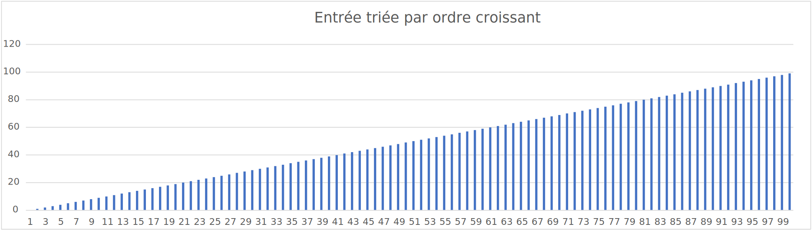
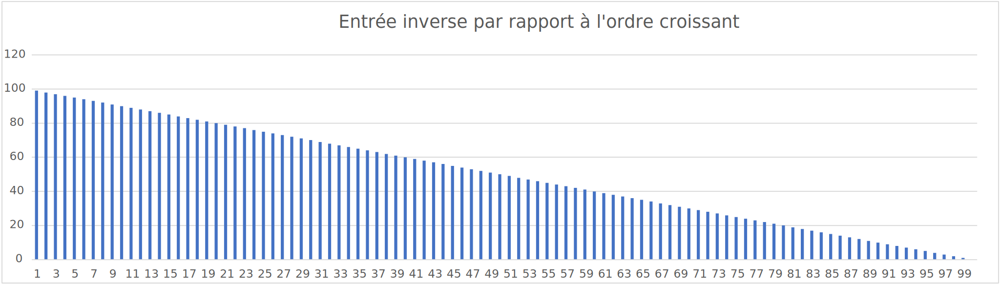
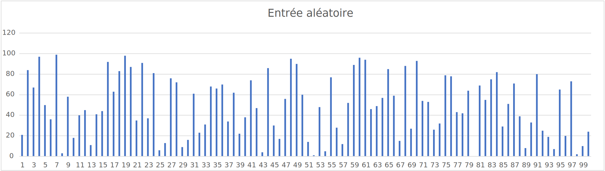
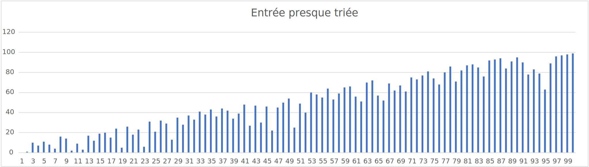

# Enoncé 

## Objectifs

Le objectifs de ce premier laboratoire d'ASD sont les suivants : 

* Vous rappeler les 3 algorithmes de tri simples vus en PRG1 
    * tri à bulles
    * tri par sélection
    * tri par insertion
* Vous faire découvrir les propriétés des algorithmes de tri de la STL : `std::sort` 
  et `std::stable_sort`
* Vous faire estimer des complexités en mesurant empiriquement
    * le nombre de comparaisons
    * le nombre d'affectations
    * le temps de calcul
* Vous faire constater que l'ordre des entrées peut avoir une influence 
sur la complexité de certains algorithmes de tris, et qu'il faut donc
  considérer le meilleur cas, le pire et le cas moyen. 
* Vous faire mettre en oeuvre tout ce qui précède en C++ en utilisant 
en particulier les chapitres 7 et 8 de PRG1 (classes et généricité).
  
## A faire 
1. Faites un fork de ce repository par groupe, éditez-en les settings pour 
le rendre disponible à tous les membres de votre groupe mais privé pour le 
  reste

1. Modifiez le [README.md](../README.md) principal pour y inscrire le 
  numéro de votre groupe et vos noms. 

1. Dans le répertoire [src](../src), écrivez le code C++ décrit dans la section 
   suivante. Il doit stocker les mesures effectuées dans divers fichiers au format csv (comma separated values). 

1. Stockez les fichiers générés dans le répertoire 
  [rapport/csv](../rapport/csv). Un exemple d'un tel fichier vous est fourni. 
1. A partir de ces fichiers csv, générez des graphiques au format .svg reprenant 
en abscisse la taille N et en ordonnée vos mesures pour les différents algorithmes 
  comparés. La méthode la plus simple pour cette conversion est sans doute d'importer
  les fichier csv dans excel puis de générer les graphiques "nuage de points 
  avec lignes et marqueurs" à partir des données. Choisissez bien les types 
  d'axes de vos graphes. 
1. Enfin, produisez un rapport comparant les différents tris. Ecrivez-le au format
markdown dans le répertoire [rapport](../rapport). Un exemple est fourni. Ce rapport
  doit reprendre vos tableaux de données et graphiques, commenter les performances
  relatives des 5 algorithmes en fonctions des entrées fournies, tenter d'expliquer
  les temps de calculs observés par le nombre de comparaisons et 
  d'affectations effectuées. 
  
Pour rendre votre laboratoire, il faut 
* tagger le commit final sur votre repo avec le tag "Rendu". N'oubliez pas de pusher le tag sur GitHub
* soumettre le lien vers votre repo sur cyberlearn comme rendu de groupe 
  
## Code C++ à écrire

1. des fonctions génériques permettant de trier par ordre croissant avec chacun des 3 tris simples
    des `std::vector` d'éléments de type quelconque. Ces fonctions peuvent à 
    choix prendre en paramètre soit des itérateurs comme dans la librairie 
    `<algorithm>`, soit un vecteur reçu par référence.
1. un programme principal qui teste que vos 3 fonctions effectuent le tri correctement. Il suffit de vérifier 
      que le résultat est trié. Vous pouvez en vérifier toutes les étapes si vous avez un doute 
      sur votre algorithme, mais cela ne vous donne pas de bonus sur la note. 
1. une fonction générant des `vector<T>` qui vont servir d'entrées aux tests de complexité. Dans ce qui suit, 
      l'argument générique `T`ce sera soit un type numérique existant du C++ pour
      les mesures de temps d'exécution, soit le type OpCounter que vous créerez pour les mesures de
      nombre d'opérations. Cette fonction générique a pour paramètres
    1. la taille N du `vector` à générer 
    1. une valeur numérique servant de `seed` au générateur de nombre aléatoire utilisé, ce qui permet
       de recréer la même séquence aléatoire si vous ré-utilisez le même `seed`.
    1. un paramètre énuméré spécifiant le type d'entrée à générer entre les 4 suivants 
        * une entrée triée par ordre croissant

        * une entrée triée par ordre décroissant

        * une entrée entièrement aléatoire avec des valeurs toutes différentes.
La fonction [std::shuffle](http://www.cplusplus.com/reference/algorithm/shuffle/)
pourra vous être utile.

        * une entrée "presque" triée. Les valeurs ne doivent pas nécessairement être toutes différentes.
Une approche simple consiste à prendre une somme pondérée d'une entrée triée et d'une entrée aléatoire.

1. un 2ème programme principal effectuant des mesures de temps de calcul pour trier des `vector<int>` avec
    1. vos 3 fonctions plus `std::sort` et `std::stable_sort`
    1. les 4 types d'entrées ci-dessus
    1. une gamme de valeurs de tailles N bien choisie
1. une classe `OpCounter` qui stocke une valeur numérique par objet, et maintient
des variables statiques de classe comptant les opérations pertinentes. Cette
classe doit mettre en oeuvre les constructeurs / opérateurs nécessaires
pour être triable par vos fonctions et celles d'`<algorithm>`. Elle doit
compter toute comparaison et toute copie (constructeur ou affectation). Il
est sans doute plus pratique qu'elle fournisse aussi une méthode statique
pour réinitialiser les compteurs d'opérations.
1. un troisième programme principal similaire au 2ème mais qui compte le
nombre de comparaisons et le nombre d'affectations plutôt que de mesurer
le temps de calcul
   
## Conseils

* des exemples de code / fichier csv / graphiques / fichier markdown vous sont 
fournis. Commencez par les lire. 
* découpez votre code en fichiers indépendants, cela le rendra plus lisible et 
  vous facilitera la tâche pour "merger" les contributions des différents membres 
  du groupe sous git. 
* partagez-vous le travail, mais relisez / comprenez les contributions des autres
  membres du groupe.   
* commitez et pushez régulièrement votre code sous git. Cela simplifiera la 
  collaboration au sein de votre groupe. Par ailleurs, il est important que 
nous puissions suivre / évaluer votre progrès et les contributions respectives 
  des différents membres du groupe. 
