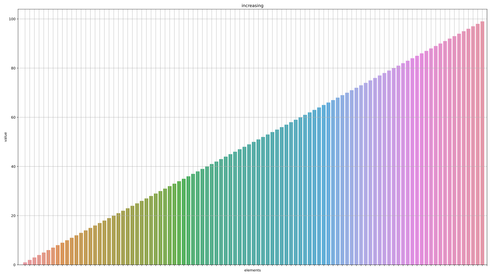

# L1 - Complexité

### Motivation
Le problème de tri est considéré comme un des problèmes fondamentaux de l'Informatique, car en tant qu'êtres humains, il nous est plus  facile de traiter de l'information lorsqu'il existe une notion "d'ordre". Dans l'actualité, la quantité d'information traitée  par les ordinateurs est de plus en plus conséquente. Il est donc nécessaire d'avoir des algorithmes de tri autant performant que nécessaire. 
La motivation de ce labo est donc d'analyser certains algorithmes ainsi que répondre à un certain nombre de questions sur leur fonctionnement.

### Objectif
Le but premier de ce labo est de nous faire revoir les algorithmes de tri simples vus en PRG1 ainsi que découvrir ceux de la STL `std::sort` et `std::stable_sort`.

Deuxièmement, on cherchera à analyser les différents tris en prenant compte de certaines mesures comme : leur nombre de comparaisons, leur nombre d'affectations et leur temps de calcul.

Finalement, on cherchera à définir s'il existe un meilleur tri qu'un autre et on cherchera à établir si ces mesures restent constantes indépendamment des entrées fournies.

### Procedure
Pour y parvenir, nous avons été emmenés à concevoir un certain nombre de classes et méthodes nous permettant de prendre les mesures nécessaires.

Dans un premier temps, nous avons conçu des méthodes simulant les algorithmes de tri à bulles, tri par sélection et tri par insertion.

Deuxièmement, nous avons créé une fonction générique générant des `vector<T>` pouvant avoir comme argument générique `T`,  un type numérique de C++ pour mesurer le temps d'exécution ou un type OpCounter nous permettant de mesurer le nombre d'opérations.

Cette fonction crée les entrées suivantes :
- Une entrée triée dans l'ordre croissant

- Une entrée triée dans l'ordre décroissant

- Une entrée complètement aléatoire

- Une entrée presque triée

De plus, nous avons conçu un programme nous permettant de mesurer le temps pour trier les entrées précédentes. Un deuxième comptabilisant le nombre comparaisons et affectations.
Ainsi que la classe OpCounter dans le but de compter cette fois-ci le nombre d'opérations pertinentes (comparaisons et copies). 

Nous avons utilisé la gamme de valeur suivante pour faire les tests : 
N = [ 0, 10, 25, 50, 100, 500, 1000, 2500, 5000, 7500, 10000, 15000, 20000, 25000, 35000, 50000 ]

### Types de tri
Nous avons vu dans le cours que tout algorithme a une certaine complexité dépendant du cas dans lequel on se trouve. 
Nous avons donc constaté que les algorithmes de tri simple ont les complexités suivantes :
- Tri à bulles :
  - Pire cas : )
  - Moyenne : )
  - Meilleur cas: )

- Tri par sélection : 
  - Pire cas : )
  - Moyenne : )
  - Meilleur cas: )

- Tri par insertion :
  - Pire cas : )
  - Moyenne : )
  - Meilleur cas: )

Pour la complexité des algorithmes de la STL nous avons pris comme source [cplusplus.com](https://www.cplusplus.com/)
- `std::sort` : 
    - Il nous est garanti une complexité de ))

- `std::stable_sort` :
  - Il nous est garanti une complexité de ^2)) 
Or si de la mémoire additionnelle est disponible, une complexité de ))
est garantie

### Résultats
#### Nombre de comparaisons
- Entrée triée par ordre croissant

InsertionSort = BubbleSort < std::stable_sort < std::sort < SelectionSort

- Entrée triée par ordre décroissant

std::stable_sort < std::sort < SelectionSort = InsertionSort = BubbleSort

- Entrée aléatoire

std::stable_sort < std::sort < InsertionSort < SelectionSort = BubbleSort

- Entrée presque triée

std::stable_sort < std::sort < InsertionSort < SelectionSort = BubbleSort

##### Observation
Nous pouvons constater que le nombre de comparaisons faites par SelectionSort a une complexité de 
) indépendamment du type d'entrée qui lui est fourni.

En revanche, le BubbleSort et InsertionSort trouvent un nombre de comparaisons similaire de 
) lorsque l'entrée est déjà triée.

Néanmoins, ils retrouvent tous les trois un nombre de comparaisons de )
lorsque l'entrée est en ordre décroissant, aléatoire ou partiellement triée.

En ce qui concerne les tris de la STL, le nombre de comparaisons de ))
reste également constant dans tous les cas.

#### Nombre d'affectations
- Entrée triée par ordre croissant

Aucune affectation de Bubble Sort et Insertion  
SelectionSort < std::sort < std::stable_sort

- Entrée triée par ordre décroissant

SelectionSort < std::sort < std::stable_sort < InsertionSort = BubbleSort

- Entrée aléatoire

SelectionSort < std::sort < std::stable_sort < InsertionSort = BubbleSort

- Entrée presque triée

SelectionSort < std::sort < std::stable_sort < InsertionSort = BubbleSort

##### Observation
Nous pouvons constater l'absence d'affectations de la part de BubbleSort et InsertionSort lorsque l'entrée est complètement
triée. En revanche, SelectionSort aura tendance à réaliser des affectations sur le même emplacement sans faire une comparaison.

En retour, SelectionSort se trouve plus performant que les autres lorsque l'entrée est dans l'ordre décroissant ou aléatoire avec 
) affectations. Contre )
affectations de la part de BubbleSort et InsertionSort.

Comme avec le nombre de comparaisons, `std::sort` et `std::stable_sort` reste sur le même nombre d'affectations de ))
indépendamment du cas.

#### Nombre d'opérations
- Entrée triée par ordre croissant

BubbleSort = InsertionSort < std::sort < std::stable_sort < SelectionSort

- Entrée triée par ordre décroissant

std::sort < std::stable_sort < SelectionSort < InsertionSort = BubbleSort

- Entrée aléatoire

std::stable_sort = std::sort < SelectionSort < InsertionSort < BubbleSort

- Entrée presque triée

std::sort < std::stable_sort < SelectionSort = InsertionSort < BubbleSort

##### Observation globale
Le nombre d'opérations rejoint ce que nous avons constaté jusqu'à maintenant.

SelectionSort se trouve en général avec une complexité de )
à cause de son grand nombre de comparaisons. BubbleSort et InsertionSort ont une grande similitude avec ce dernier avec une petite différence
dans le cas où l'entrée est déjà triée. Dans ce dernier cas leur complexité est de )
mais en général cette dernière est de ).

Il est intéressant de voir que le nombre d'affectations réalisées par InsertionSort dépend du nombre de comparaisons.
Tandis que BubbleSort réalise une affectation pour chaque comparaison effectuée.

Quant aux algorithmes de la STL, il nous a été garanti une complexité de 
)) en général. Cette garantie a été
tenue dans tous les tests indépendamment du type d'entrée fourni. Ceci est principalement dû aux algorithmes sur lesquelles
ces derniers se basent.

Selon [cppreference](https://en.cppreference.com/w/), `std::sort` utilise comme algorithme l'[IntroSort](https://en.wikipedia.org/wiki/Introsort)
Tandis que `std::stable_sort` utilise le [MergeSort](https://en.wikipedia.org/wiki/Merge_sort) pour réaliser les opérations.

#### Temps de calcul
- Entrée triée par ordre croissant

BubbleSort = InsertionSort < std::sort = std::stable_sort < SelectionSort

- Entrée triée par ordre décroissant

std::sort = std::stable_sort < BubbleSort = InsertionSort = SelectionSort

- Entrée aléatoire

std::sort = std::stable_sort < BubbleSort = InsertionSort = SelectionSort

- Entrée presque triée

std::sort = std::stable_sort < InsertionSort <= BubbleSort = SelectionSort

##### Observation
Il est important de noter que nous avons effectué les tests sur un ordinateur ayant un processeur de 4.7 GHz max.

Même si le temps de calcul n'est pas représentatif, car le temps peut fortement varier d'une machine à une autre,  nous pouvons voir que la différence du temps se fait beaucoup plus grande au fur et à mesure que le nombre d'éléments à trier croît.

### Conclusion
En conclusion, les tris simples que nous avons étudiés en cours ne sont pas très efficaces en général. Même si dans certaines circonstances les algorithmes de tri simple peuvent être très rapides, on constate rapidement que `std::sort` et `std::stable_sort`  sont beaucoup plus performant, car leurs algorithmes sont beaucoup plus sophistiqués.

