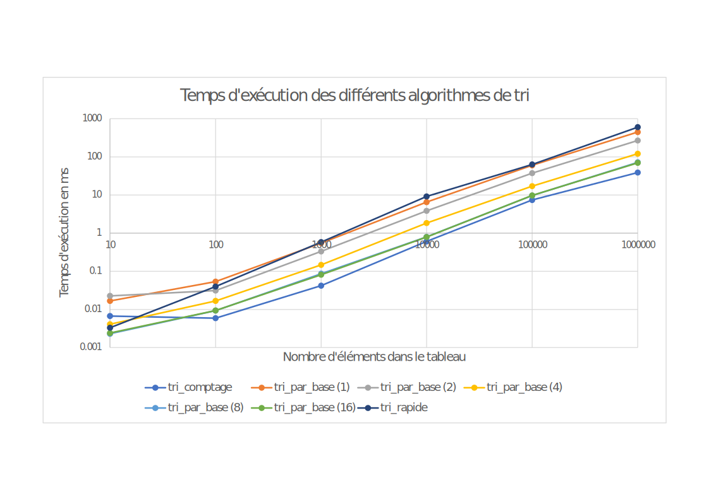

# L3 - Tris

## Tri rapide
### Compléxité temporelle théorique
- Pire cas : O(n2)
- Cas moyen : O(n*log(n))
- Meilleur cas :  O(n*log(n))

## Tri par base
### Compléxité temporelle théorique
- Pire cas : O(w*n)
- Cas moyen : O(w*n)
- Meilleur cas : O(w*n)

## Rapport
|n                 |10      |100     |1000   |10000  |100000 |1000000|
|------------------|--------|--------|-------|-------|-------|-------|
|Tri comptage      |0.0067  |0.0059  |0.0421 |0.6066 |7.4055 |38.8467|
|Tri par base (1)  |0.0167  |0.0537	 |0.5476 |6.521  |59.9141|448.615|
|Tri par base (2)  |0.0226  |0.0313	 |0.3319 |3.868	 |37.5507|268.474|
|Tri par base (4)  |0.0041  |0.0167	 |0.1474 |1.842	 |17.157 |121.127|
|Tri par base (8)  |0.0023  |0.0093	 |0.0864 |0.7994 |9.679	 |71.9656|
|Tri par base (16) |0.0024  |0.0094	 |0.0815 |0.791	 |9.7889 |69.9059|
|Tri rapide        |0.0033  |0.0398  |0.5825 |9.1517 |63.6429|601.694|

Lien vers les données : [data.csv](csv/data.csv)

Comme on peut le voir via le graphiques et les données, les algorithmes de tris ont une évolution très similaire et des complexités très proche.
Mais malgré tout, de manière générale, le tri par base, quelque soit la base utilisée, est plus rapide que le tri rapide.

On peut souligner que le tri par base (8) a un jeu de données extrêmement proche au jeu de données du tri par base (16), ce qui est logique car étant données que les valeurs traitées sont sur des octets, travailler sur un ou deux octets est beaucoup plus rapide que de travailler sur des parties d'octets, comme le feraient les tris par base (1), (2) & (4). 

À noter aussi que sur des tableaux qui contiennent peu d'élément, le tri rapide est plus efficient que certains tri par base mais se fait vite surclasser.

Le tri comptage est ici à titre indicatif, sachant que le tri par base utilise plusieurs fois le tri comptage, il est logique qu'une seule utilisation du tri comptage prenne moins de temps qu'un tri qui l'utiliserait plusieurs fois
